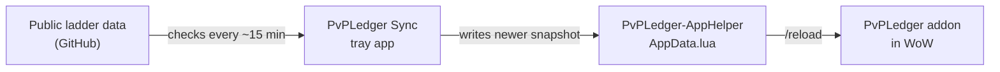

# PvPLedger

PvPLedger is a World of Warcraft addon that combines your in-game PvP observations with imported ladder snapshots. The **PvPLedger Sync** desktop app keeps those ladder snapshots up to date automatically.

This guide explains where to find the sync app, how to install it, and how it feeds fresh ladder data into the in-game addon.

---

## What you need in WoW

Enable these addons in the WoW AddOns list:

| Addon | Purpose |
|-------|---------|
| **PvPLedger** | Main UI, match tracking, ladder browser |
| **PvPLedger-AppHelper** | Bridge that receives ladder data from the desktop sync app |

Optional regional data addons (for example `PvPLedger-Data-EU`) can also ship ladder snapshots, but **PvPLedger Sync + AppHelper** is the recommended way to stay current without manual downloads.

After installing or updating ladder files, run **`/reload`** in WoW so the addon picks up the new data.

---

## Where to find PvPLedger Sync

### Option A — Installer (recommended for most players)

If you received a release package or built the project yourself, the Windows installer is produced by:

```bat
release\build_release.bat
```

The installer artifact lives at:

```
Sync/dist/PvPLedger-Setup.exe
```

Run **`PvPLedger-Setup.exe`**. It will:

1. Install **PvPLedger** and **PvPLedger-AppHelper** into your WoW `Interface/AddOns` folder
2. Copy **PvPLedger-Sync.exe** to your PC
3. Optionally start the sync app at Windows login

After setup, the tray app is installed at:

```
%LOCALAPPDATA%\Programs\PvPLedger\PvPLedger-Sync.exe
```

Look for the PvPLedger icon in the Windows system tray (near the clock).

### Option B — Build it yourself

Developers and contributors can build the installer from the `Sync/` folder:

```bat
cd Sync
build_installer.bat
```

That produces:

- `Sync/dist/PvPLedger-Setup.exe` — friend-friendly installer
- `Sync/dist/PvPLedger-Sync.exe` — tray app only

Requirements: Python 3 and the packages listed in `Sync/requirements.txt`.

### Option C — Run from source (no installer)

If you already have Python 3:

```bat
cd Sync
run_sync.bat init --addons-dir "C:\Path\To\World of Warcraft\_retail_\Interface\AddOns"
run_sync.bat tray
```

---

## Installing step by step

1. **Close WoW** (recommended while copying addon files).
2. Run **`PvPLedger-Setup.exe`**.
3. Confirm your **WoW AddOns folder** — usually:
   ```
   ...\World of Warcraft\_retail_\Interface\AddOns
   ```
4. Leave **Run PvPLedger Sync at Windows login** checked so ladder updates happen in the background.
5. Click **Install**.
6. Open WoW and enable **PvPLedger** and **PvPLedger-AppHelper**.
7. Run **`/reload`**.

The installer UI follows your **Windows display language** when a translation is available.

---

## How ladder sync works

WoW addons cannot download files from the internet directly. PvPLedger Sync runs on your PC, fetches updated ladder data, and writes it into a small bridge addon that PvPLedger reads in-game.



### What the sync app does

1. **Polls** the public PvPLedger ladder repository on GitHub for a newer `AppData.lua` payload.
2. **Compares** the remote snapshot date with what is already installed.
3. **Downloads and writes** the updated file to:
   ```
   Interface/AddOns/PvPLedger-AppHelper/AppData.lua
   ```
4. **Notifies you** (Windows toast) when ladder data changed.
5. You run **`/reload`** in WoW so PvPLedger imports the fresh snapshot.

If GitHub is unreachable, Sync can fall back to a local copy when one is available (for example when developing in this repository).

### What PvPLedger does with the data

On login (and when you run `/pvl update`), PvPLedger:

1. Loads bundled ladder snapshots shipped inside the addon
2. Reads newer snapshots from **PvPLedger-AppHelper** when present
3. Optionally merges in regional **PvPLedger-Data-{REGION}** companion addons
4. Uses the **newest** snapshot per bracket for the ladder browser, title cutoffs, and standing estimates

In-game, open **Ladder** or run **`/pvl status`** to see which snapshot is active and how old it is.

### Regions

Sync defaults to the **US** ladder region. To use EU, KR, or TW data, set the region in:

```
%APPDATA%\PvPLedger\sync-config.json
```

Or re-run setup:

```bat
Sync\run_sync.bat init --addons-dir "...\AddOns" --region EU
```

Match the same region in WoW under **Options → AddOns → PvPLedger → Ladder region**.

---

## Using the tray app

Left-click the tray icon to open or close PvPLedger windows (same as `/pvl`).

Right-click the tray icon for:

| Action | What it does |
|--------|----------------|
| **Sync ladder now** | Force-check GitHub and update `AppData.lua` immediately |
| **Upload exports now** | Send pending match exports collected by the addon (community sync) |
| **Show status** | Display the latest sync message |
| **Open AppHelper folder** | Open the folder where ladder data is written |
| **Open config folder** | Open `%APPDATA%\PvPLedger` settings |
| **Exit** | Stop the background sync app |

Leave the tray app running while you play so ladder data stays current. It checks for updates about every **15 minutes** by default.

When Sync updates ladder files, you will see a notification reminding you to **`/reload`** in WoW.

---

## In-game commands (quick reference)

| Command | Description |
|---------|-------------|
| `/pvl` | Toggle the main window |
| `/pvl status` | Show active region, snapshot age, and data sources |
| `/pvl update` | Refresh imported ladder data from installed sources |
| `/pvl options` | Open PvPLedger settings |

Enable **Auto-refresh ladder data on login** in PvPLedger settings so the addon reloads snapshots whenever AppHelper has newer data.

---

## Troubleshooting

**Ladder view is empty after sync**

- Run **`/reload`** in WoW.
- Confirm **PvPLedger-AppHelper** is enabled.
- In the tray app, use **Sync ladder now**, then `/reload` again.
- Run **`/pvl status`** — if the player index is empty, the published snapshot may not include player names yet.

**Sync app does not start**

- Check that `PvPLedger-Sync.exe` exists under `%LOCALAPPDATA%\Programs\PvPLedger\`.
- Re-run **`PvPLedger-Setup.exe`** or start the tray app manually from that folder.

**Wrong region**

- Align the region in `%APPDATA%\PvPLedger\sync-config.json` with the **Ladder region** setting in WoW options.

**Uninstall the desktop app only**

- Run **`PvPLedger-Setup.exe`** and click **Uninstall Sync**.
- Your WoW addons and saved settings are kept.

---

## Folder reference

| Path | Contents |
|------|----------|
| `PvPLedger/` | Main WoW addon (this folder) |
| `PvPLedger-AppHelper/` | Bridge addon; `AppData.lua` is updated by Sync |
| `PvPLedger-Data-US/` (and EU, KR, TW) | Optional regional ladder data addons |
| `Sync/` | Desktop sync app source and build scripts |
| `Sync/dist/PvPLedger-Setup.exe` | Windows installer (after build) |
| `%LOCALAPPDATA%\Programs\PvPLedger\` | Installed tray app |
| `%APPDATA%\PvPLedger\sync-config.json` | Sync settings (region, poll interval, paths) |

---

## Match export upload (optional, off by default)

Match sharing is **disabled by default**. Enable it in WoW under **Options → AddOns → PvPLedger → Share match data with PvPLedger Sync**.

When enabled, logging out queues a schema v2 export batch for the desktop sync app. Upload runs automatically when PvPLedger Sync is running. See [Privacy & data collection](#privacy--data-collection) below.

---

## Privacy & data collection

### Always (no opt-in required)

| Data | Where | Purpose |
|------|-------|---------|
| Ladder snapshots | Downloaded from public GitHub → `PvPLedger-AppHelper` | Ladder browser, title cutoffs |
| Local match history | `SavedVariables` on your PC | Your match log and CR history in-game |

### Only when **Share match data** is enabled

On logout, the addon may queue:

- Match metadata and rosters
- Combat summaries (damage, healing, interrupts, dispels, CC, spell breakdowns)
- Raw combat events captured during the match (where the client allows)
- Your Battle.net identity (BattleTag, account id) and character GUID
- Snapshots of `PvPLedgerDB` / `PvPLedgerCharDB` (settings, observations, CR history)

PvPLedger Sync uploads queued batches to the configured ingest endpoint (community server). You can disable sharing at any time in addon settings; queued data is not uploaded until Sync runs after logout.

### PvPLedger Sync desktop app

- Reads `PvPLedger_AppHelperDB` export queue from WoW SavedVariables
- Does **not** upload ladder downloads to the ingest API
- Stores sync settings in `%APPDATA%\PvPLedger\sync-config.json`

---

## Publishing & release builds

Maintainers: see [`release/RELEASE.md`](release/RELEASE.md) and [`release/CHANGELOG.md`](release/CHANGELOG.md).

Quick build:

```bat
release\build_release.bat
```

Produces CurseForge/Wago zips in `release/dist/` and Windows installers in `Sync/dist/`.

---

Questions or issues? Open a discussion or issue on the [PvPLedger GitHub repository](https://github.com/simplebooleanjim/PvPLedger).
